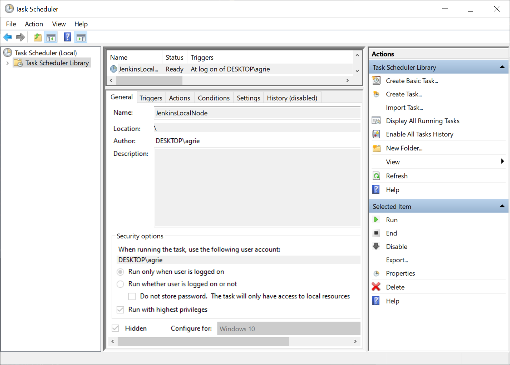

<!-- desc: Journaling -->
# 2020/4/10 - Journaling

## Background

I'm told having a developer journal is a good thing. I know having a developer journal is a good thing. I've kept a developer journal in the past (in physical form and digital form.) Why have I not kept it up? I think the simple answer is impatience and rush. Why start now? Coronavirus? Nah .... I think its because I am finishing up graduate school and am now an old man (almost 36!) and can better see the disservice that I've done myself by not attempting more of my projects with my full attention. All to often my interest and attention is pulled into many directions at once. This leads me to do everything with a lower quality to help more people. What I've been left with is nothing more than a bunch of folks with requests that I promise and never fulfil.

This overload is something that I called quits on before the COVID-19 struck in the US. Back in February, I was already in discussions with even my work management about my concerns of overload. In addition, I've been pontificating to everyone willing to listen that I want to work for myself, or work on projects that have a clearly defined consumer, start, middle, and end. We'll have to see how that turns out in my professional career, although this journaling thing here is not that.

## Overview

This journaling thing is merely a place to record engineering practices, notes, challenges, for my personal growth as a engineer (or general problem solver.) I am always tucking away post-its or files with goodies in all kinds of repositories (public and private) that really don't belong there. You really should see the number of "clutter" folders I have lying around. In any case, I am attempting to have more defined locations for this information. Also, as a result of these journal entries I get to have a sort of retrospective on my current projects. ... something without the bullshit associated with social networking.  

For this Journaling attempt, since it is personal, I am going to be playing it loose. Not periodic, but hopefully regular. At some point I'm going to need to feel results or I'll stop. Therefore I think I'll start with a baseline template for each entry that gets me on a good footing. I do this with my kids as well at dinner time. Instead of "How was your day?", we ask: "What was the best part of your day?", "What was something nice you did?", etc. Of course this isn't a character building session so we'll be more practical. Based on some quick google searches I've found the following template to be a good starting point:

- Discoveries
  - Insights / Ideas / Outlook
  - Facts / TIL
  - Resources (URLs, etc.)
  - Unknowns/Risks/Issues (for later)
- Solutions/Decisions - the what/why

The discoveries will generally be covered by this journal. They are free form and aim to capture the data as well as give me an opportunity to reflect what I've acquired or learned.

The solutions and decisions may exist as a journal entry or as a design document associated with a specific project. Design documents are formed in the ADR format. A great article on the subject can be found written by Michael Nygard called [Documenting Architecture Decisions](http://thinkrelevance.com/blog/2011/11/15/documenting-architecture-decisions)

My version of ADR is basically the following:

* Context
* Decision
* Impact / Consequences

All that said, lets get into it...

## Recently

### GUT

GUT (Godot Unit Test Framework), provided by bitwes at [Github](https://github.com/bitwes/Gut) is a fantastic tool. It has turn key integration into Godot projects. It provides a drop in scene graph node tree for easy integration of its GUI interface. And my favorite is that it has a command line interface (CLI). The issue with GUT is that the author has acknowledged that it kicks off warnings and it has a bunch of reference and memory leaks. Albeit, these are leaks that only seem to occur at the close of the application, they clearly create noise for troubleshooting my own projects that I would like to have tested. So while GUT clearly provides a fantastic baseline for a unit test framework it looks like there is a lot of polish that needs to occur before I would call it production quality. 

Because of the issues mentioned about GUT, I've made the decision to create my own unit test library for Godot that I am, so far, calling GUT Lite (gutlite). The general idea was to take the more commonly used assertions, the command line parsing from GUT and roll my own test runner on top of that. I would like to write an ADR on this subject alone, but there are a lot of issues to be resolved first. 

* My initial response to the GUT issues was to naturally fix them ... but alas I fear the issues either stem from the actual architecture of the code. I also can not prove this to be the case because of my limited debugging capabilities in GDScript. Ugh. 
* My second thought was to minimized GUT so that with a lot of its complexity removed, I may be able to more easily envision the changes that needed to occur to clean up the coding issues. I've done this a couple years back when GUT was a lot less mature, and it seems like things have gotten a lot more tightly coupled since then.
* My final decision was to start my own framework from scratch. I grabbed the loosely coupled assertions from GUT, I grabbed the loosely coupled command line parsing from GUT, and I grabbed some support code for the GUT test runner code. For the most part, I've been able to keep my code and the GUT code separate with class hierarchy. 

Base on the final decision to roll my own test framework, I came to the realization that if I were to attempt to upstream anything into GUT, it would be the idea that the core of GUT should be exposed as a collection of loosely coupled base classes. GUT would then provide a production/turn-key solution based on that core collection of classes. *Of course now I need to start that conversation and work from GUT's master if I plan to have that go anywhere. ... So lets get some tests written first and publish a gutlite library as a model.*

### Jenkins

As part of a genuine effort to make my pet game projects more professional, I decided to fire up a Jenkins instance on my personal computer. I think of this as super professional and in the vain of doing regular backups ... which I've been doing from C: -> D: as a windows scheduled task for about a year now. In any case, I am familiar with the Jenkins of 2010. Starting up Jenkins in 2020 and on Windows to boot, it was quite an eye opener. I took a bunch of time to learn the Jenkins Pipeline and I now have a somewhat working Jenkins setup on my windows machine and a working Jenkinsfile in one of my projects. 

#### Windows

Jenkins on windows was a pain (and yet I bet it was easier than dealing with Linux.) There was at least 1 ugly step that I am still not satisfied with, but seems to be working for now. Godot has a headless build that allows you to build its projects without a GUI or desktop environment. Trouble is that it is only built for Linux. I am still going through some experiments to determine if I can build a console only Godot for windows, but the results so far have not been promising.

To setup and automated build with Godot in Windows, you have to have a desktop. Luckily, Jenkins allows its slaves to be run within a GUI environment. This is different from its master server which runs as a Windows service as SYSTEM (with no apparent access to the desktop environment.) The point here is that I setup a *LocalNode* slave that is run as me, the user, when I log onto the system. The fact that I have to be logged on is a known issue, but one I am willing to deal with because I don't plan to run nightly builds anyway. The way we startup the LocalNode is with a Windows Task Scheduler task.

The one thing that is not shown here is the fact that I modified the run trigger so that it is delayed by 1 minute to give the Jenkins service time to settle if I am logging in at bootup.

The other big deal that I found when dealing with Jenkins slave running as a scheduled tasks is the annoying console popups that would happen. At some point this just seemed to go away and I don't know why. Maybe because I chose "hidden"? Maybe because I ran the slave wrapped with `cmd.exe /C START /MIN` ?  

Lastly, the way to execute Godot so that it doesn't pop itself during the builds and tests on the slave, I ran with commands that are similar to the following:

* `C:\path\Godot.exe --export-debug Platform C:\build-path ^`

  `--no-window --windowed -resolution 1x1 --position 0,0`

* `C:\path\Godot.exe --no-window -s relpath/script.gd`

The arguments on the Godot command line appear to be context sensitive without enough documentation to know when they take effect. The two biggest contexts are editor vs non-editor. Godot is itself a special version of a Godot project, but because it is special it doesn't view the command line argument the same for itself as it does for its *guest* projects. This can be frustrating, but is rare enough to not matter yet. There are tickets in Github requesting that the headless server be build for all Godot supported platforms. This would solve a lot of my headaches, but its not here yet. In summary, the exported projects are usually flawless when it comes to the arguments of the Godot.exe, but when attempting to affect the behavior of Godot with the arguments is just inconsistent at best.

In conclusion, I've been able to setup what seems to be a reliable and versatile setup for Jenkins on Windows for exporting and testing Godot projects. This needs to be fleshed out a bunch more, but looking further down the line, I'd like to be able to publish test releases or early access releases to something like Steam or Google Play sooner than later.

### GDScript Memory

GDScript doesn't have smart pointers like C++, static memory analysis like Rust, or garbage collection like every other interpreted language on the planet. Instead the went with, what I personally prefer, reference counting. I've been a big fan of reference counting ever since I got involved with Linux kernel hacking. Real simple, when references go to zero, free the memory. Trouble with reference counts is that there is no safety net. When you forget to decrement a reference, the memory leaks. When you don't have a clear understanding of who owns the reference, you'll never decrement the count and therefore never free the memory. 

The problems with GDScript reference counting only became apparent to me 2 days ago when I started building my projects from command line in verbose mode. Like valgrind, Godot has this awesome feature where it displays all the leaked references and instances on exit. My assumption is that if they are leaked on exit, who is to say there aren't long term leaks that may occur over time. I simply had to fix this. Digging not so deep, I immediately was met with the awkward ness of reference counting in GDScript: There is no way to determine how many references remain. Bah! ... So basically I have to ascend to uber developer and statically hunt down the clobbered references. This is combined with the fact that it is assumed that the GDScript developer should never have to know about the reference counts. So sometimes, you'll have nodes that free its containing nodes automatically, and others that allow references to be clobber and leaked. This inconsistency is maddening. 

One last weird design decision that should probably have a ticket is the fact that errors and warnings output from Godot.exe don't translate into a non-zero exit code. I would like a non-zero exit code so that Jenkins can detect the failure. For now, I'll have to grep for 'ERROR' or something in a shell script and return non-zero myself. 

### GDScript Rounding Errors

Another thing I want to record is this...

https://github.com/godotengine/godot/issues/37647

It was immediately closed as a duplicate, so I followed up with a feature request:

https://github.com/godotengine/godot-proposals/issues/674

