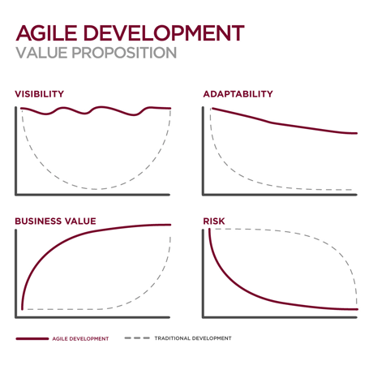

<!-- desc: Structured Dialog -->
# 2020/4/11

## Agile Value Proposition

## Wisdom Nuggets

Peter Senge suggest collective intelligence should be the goal, not a hand full of the smart individuals in the room.

Reward teams, not individuals. Blame process, not people.

Just because you can develop a solution doesn't mean you should.

## Structuring Dialog

In the course of studying Agile methodologies, when I reached a particular slide on structuring dialog, I couldn't help but notice how functional the questions in the slide were. The following is a capture of those questions under their respective categories. The thing I really want to see this used for is the assessment of all projects in my current office. We often have some light weight questions as part of our assessment like:

* How much cost? 
* What are the risks?
* ... and other vague questions that provide minimal value.

I believe that by answering the following set of questions, we'd be in a significantly better situation when questions about the existence and value proposition of a project are brought up.

Author: Menner, Will. *Agile SD Methods - Structuring Dialog* 

> ### Context
>
> Why are we here?
>
> Why is this transformation needed?
>
> What portfolio will this solution be a part of?
>
> What business or mission model / strategy applies?
>
> What is the larger context within which this transformation makes sense?
>
> What view of the domain makes this transformation meaningful?
>
> Who is the project champion?
>
> ### Inputs (Initial Conditions)
>
> What are the top problems?
>
> What are the relevant characteristics of the top problems?
>
> What is causing the problems?
>
> What are the goals and needs of our stakeholders?
>
> What is the post-transformation vision?
>
> What input or data is needed to work the problem?
>
> Who are the suppliers of input or data?
>
> What constraints are we operating under? (e.g. policies, legalities, budget, schedule)
>
> What assumptions are we making?
>
> ### Outputs (Desired Outcomes)
>
> Who cares?
>
> Who should care?
>
> How do we reach them?
>
> Who are the stakeholders?
>
> Who are the winners? losers?
>
> What potential reactions can we anticipate?
>
> How do we know when the goals have been achieved?
>
> What are the intermediate points where progress can be inspected?
>
> If successful, what is the payoff?
>
> If unsuccessful, what are the risks?
>
> ### Solution
>
> What are the best courses of action?
>
> What are the best ideas for solving the problem?
>
> How should we sequence our actions?
>
> If we were unconstrained, how would we solve the problem?
>
> Has somebody else already solved the problem or a portion of it?
>
> Who are the "performers"?
>
> What makes this project unique?
>
> Who "owns" the solution process?
>
> How is this project different from prior attempts?
>
> What implementation tools and techniques should we use?
>
> If the transformation is successful, what future or unintended consequences might occur?

## IBIS - Issue Based Information System

IBIS is another fantastic meeting facilitation technique that basically has a discussion topic broken down into problem-proposal-pros-cons. The major difference is that its visually represented on a white board with a mapping from problem to proposal, and multiple edges connecting proposal to pros and cons, and each pro and con potentially mapped to new problems and proposals. This manifests itself as a tree where all participants can visually identify other participant concerns and agendas.

## Conway's Law

The last nugget of wisdom that has stuck with me is Conway's Law. (Conway, Melvin E.)

> Any organization that designs a system (defined broadly) will produce a design whose structure is a copy of the organization's communication structure.

The general idea here is that you should expect products to be modularized in a way that matches the organizational chart for the business. Another way to put it is that, in my opinion, the organizational chart (or relevant information systems) should be organized to meet the needs of the product (and therefore the customers) and not the needs of the organization (irrespective of the product).

## Testing Godot With Android Emulator

`./emulator.exe -list-avds`

`./emulator.exe -avd Pixel-API28-v9.0-1080x1920-x86`

`/mnt/d/android-sdk/platform-tools/adb.exe install PottyTime-v0.0.3-Android.apk`

`/mnt/d/android-sdk/build-tools/29.0.3/aapt.exe \`

`d xmltree PottyTime-v0.0.3-Android.apk AndroidManifest.xml`

Have to use a non-GooglePlay system image.

`/mnt/d/android-sdk/platform-tools/adb.exe root`

`/mnt/d/android-sdk/platform-tools/adb.exe shell touch \ /data/data/org.godotengine.androidfilecheck/files/testmode`

`/mnt/d/android-sdk/platform-tools/adb.exe shell am start \`

`-a android.intent.action.MAIN org.godotengine.pottytime/com.godot.game.GodotApp`

Note: **Jenkins slaves don't have access to Windows/system32.** Need to copy bash.exe from this directory to something else in the path.  Adding C:\bin to path for a workaround.
