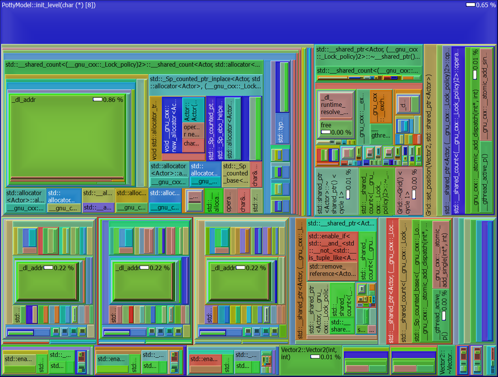

# 2020/04/25

## Profiling

I've been relearning C++ and getting used to the C++17 semantics, but I stopped for a moment to integrate a test framework. I settled on Catch. I also wanted to determine how I would document the code, I settled on Google C++ Style Guide and ad-hoc markdown. Next up is profiling. A quick google for GNU profiling in VSCode oddly brought me to a non-answer in Stackoverflow about valgrind's callgrind tool. You execute it with:

```
valgrind --tool=callgrind ./dummy
```

That created me a `callgrind.out.4433` file. This file can be visualized with kcachegrind in X11. If you have Windows, like me, you can download an equivalent tool called [QCachegrind](https://sourceforge.net/projects/qcachegrindwin/) that'll run in windows. Running that application and opening the callgrind output netted me some pretty exciting output. The following is the code for the `init_level()` call in my code:

```c++
void PottyModel::init_level(char layout[8][8]) {
    for (int y = 0; y < GRID_ROWS; ++y) {
        for (int x = 0; x < GRID_COLS; ++x) {
            if (layout[y][x] == ' ')
                continue;
            shared_ptr<Actor> obj;
            if (layout[y][x] == '*') {
                player = make_shared<Player>();
                obj = player;
            }
            else if (layout[y][x] == 'P') {
                potty = make_shared<Potty>();
                obj = potty;
            }
            else if (layout[y][x] == 'T') {
                obj = make_shared<Toddler>();
            }
            else {
                obj = make_shared<Actor>(layout[y][x]);
            }
            grid->set_position(Vector2(x, y), obj);
        }
    }
}
```

Here is the callee map from QCachedgrind:



It just blows my mind how this simple little piece of code caused all this trouble with classes that basically amount to a 8x8 grid and some ascii characters. Admittingly, I think most of this is a result of my using STL so I'll probably take a second look at that and attempt to apply some data-driven concepts to not only simplify this call map but prevent potential cache misses in the code. 

## ECS

https://www.gamedev.net/tutorials/programming/general-and-gameplay-programming/the-entity-component-system-c-game-design-pattern-part-1-r4803/

https://www.gamedev.net/articles/programming/general-and-gameplay-programming/the-entity-component-system-bountyhunter-game-part-2-r4804/